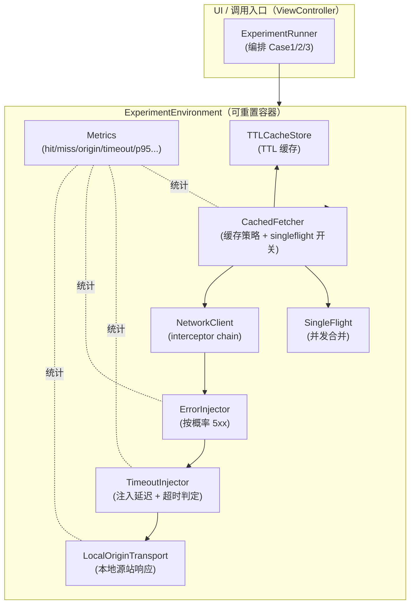
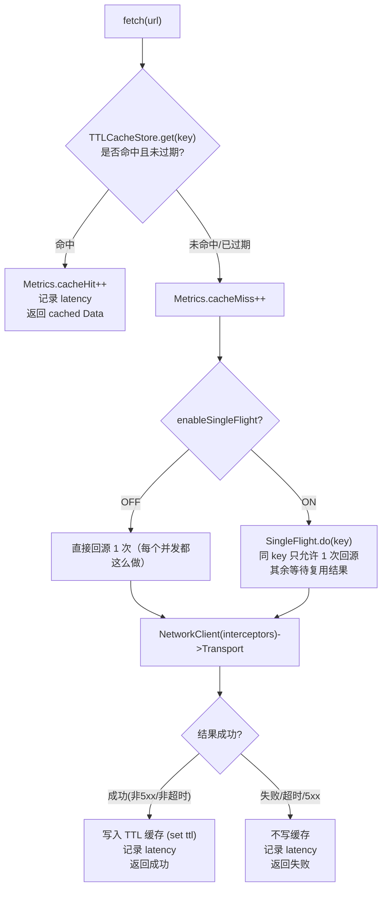
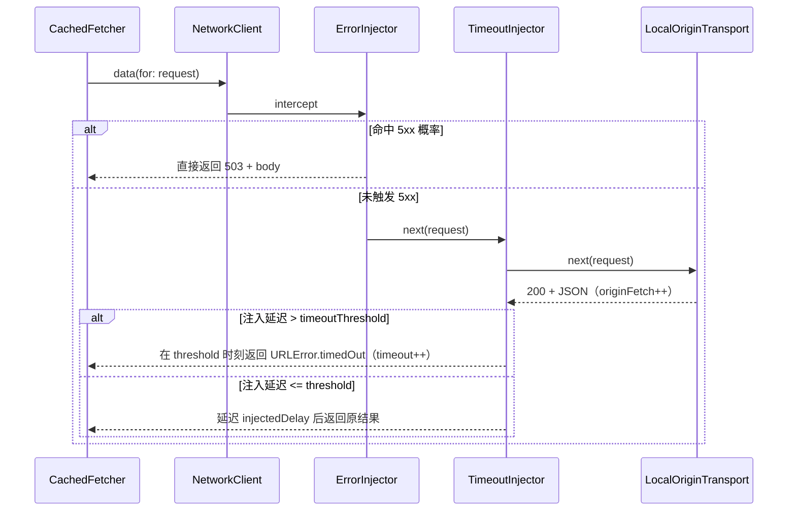
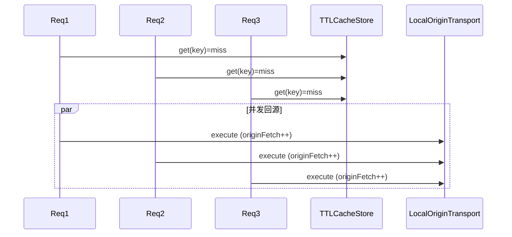
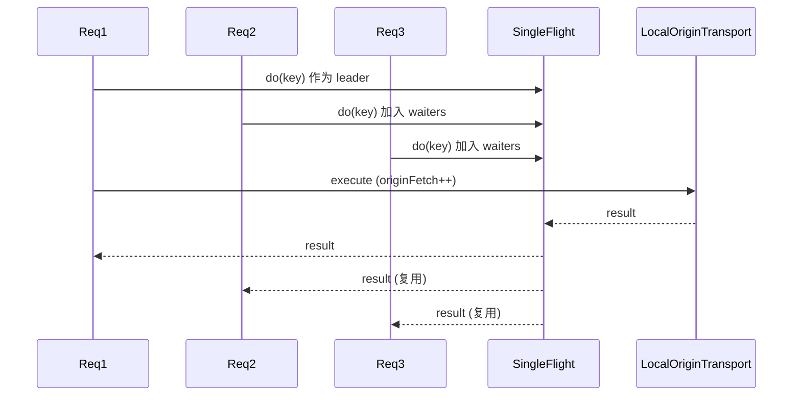

---

**1) 模块/分层图（组件视角）**



核心含义：
- `CachedFetcher` 决定“走缓存”还是“回源”，以及回源是否使用 `SingleFlight` 合并并发。
- `NetworkClient` 是拦截器链（B 方案）：`ErrorInjector -> TimeoutInjector -> LocalOriginTransport`。
- `LocalOriginTransport` 不出网，本地生成 JSON，同时用来统计 origin fetch 次数（击穿/合并最直观的指标）。

---

**2) 一次 fetch 的主流程图（命中 vs 未命中）**



关键点对应你的“严格定义”：
- 失败/超时/5xx 不写缓存（无 negative cache）。
- `expire(key)` 删除缓存条目，保证实验能稳定复现“瞬间 N 并发 + TTL 已过期”的场景。

---

**3) 拦截器链（B 方案）如何“模拟网络”**



对应代码语义：
- `ErrorInjector` 可短路直接返回 503（不走 “源站”）。
- `TimeoutInjector` 做“延迟注入 + 超时判定”：当 `injectedDelayMs > timeoutThresholdMs` 时返回 `URLError(.timedOut)` 并计数。

---

**4) 缓存击穿 vs SingleFlight 合并（最关键对照）**

同一 key，TTL 已过期的一瞬间，同时来了 N 个并发请求：

**singleflight = OFF（击穿）**

结果：`originFetch ≈ N`

**singleflight = ON（合并）**

结果：`originFetch ≈ 1`

---

**5) TTL 的“时间线图”（为什么需要 expire 才稳定复现）**

```text
t0            t0+TTL                 t0+TTL+ε
|---- 有效期 ----|----------------------|
写入缓存        过期（读到会删）        触发 N 并发（击穿/合并的实验点）
```

- 没有 `expire(key)` 时，你很难保证每次点击按钮时刚好落在 “过期后瞬间”。
- 用 `expire(key)` 等价于人为把时间线直接跳到 “过期之后”，确保 N 并发一定 miss，从而稳定观察 origin 次数差异。

---