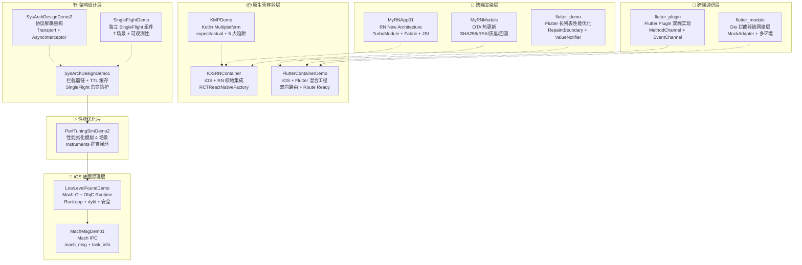

# 21DaysALLIN — iOS 技术深度 Demo 合集

> 10 年 iOS 开发经验，21 天集中梳理输出 14 个可运行 Demo，覆盖 **底层 → 跨端架构 → 性能 → 工程化** 全技术栈。

---

## 架构分层图



---

## 技能矩阵

| 技术域 | 覆盖项目 | 关键词 |
|--------|----------|--------|
| **iOS 底层原理** | LowLevelFoundDemo, MachMsgDem01 | Mach-O, Runtime, RunLoop, Mach IPC, dyld, task_info, 越狱检测 |
| **性能优化** | PerfTuningSimDemo2, flutter_demo | Instruments(Leaks/Allocations/Time Profiler), RepaintBoundary, ValueNotifier, FrameTiming |
| **架构设计** | SysArchDesignDemo1/2, SingleFlightDemo | 拦截器链, TTL缓存, SingleFlight, 协议解耦, SWR, 可观测性 |
| **React Native** | MyRNApp01, MyRNModule, IOSRNContainer | New Architecture(Fabric/TurboModule/JSI/Codegen), OTA热更新, 棕地集成 |
| **Flutter** | FlutterContainerDemo, flutter_module, flutter_plugin, flutter_demo | Add-to-App, Dio拦截器链, PlatformView, MethodChannel/EventChannel/BasicMessageChannel |
| **KMP** | KMPDemo | expect/actual, Kotlin/Native, iOS Framework 链接 |
| **工程化** | MyRNModule, LowLevelFoundDemo | CI/CD(Python+Shell), OTA发布, RSA签名, 灰度发布, Podspec |

---

## 项目索引

### 🧠 iOS 底层原理

| 项目 | 一句话 | 核心 API |
|------|--------|----------|
| [LowLevelFoundDemo](LowLevelFoundDemo/) | 7 合 1 底层原理套件 | Mach-O 解析, objc_msgSend 三阶段转发, RunLoop Mode, dyld 快照, dlopen Benchmark, 越狱检测 5 维评分, 金丝雀回滚 |
| [MachMsgDem01](MachMsgDem01/) | Mach IPC + autoreleasepool 内存分析 | `mach_port_allocate`, `mach_msg(RCV/SEND)`, `task_info(MACH_TASK_BASIC_INFO)` |

### ⚡ 性能优化

| 项目 | 一句话 | 技术手段 |
|------|--------|----------|
| [PerfTuningSimDemo2](PerfTuningSimDemo2/) | 4 种性能劣化场景 + Instruments 排查闭环 | 可控泄漏(UnsafeMutableRawPointer), View Churn(CADisplayLink), Timer Storm, CPU Burn |
| [flutter_demo](flutter_demo/) | Flutter 长列表 Bad vs Optimized 对比 | SliverList, RepaintBoundary, CachedNetworkImage, ValueNotifier, 滚动感知, FrameJankAggregator |

### 🏗️ 架构设计

| 项目 | 一句话 | 核心模式 |
|------|--------|----------|
| [SysArchDesignDemo1](SysArchDesignDemo1/) | 拦截器链 + TTL 缓存 + SingleFlight 实验系统 | Interceptor Chain, 线性衰减TTL, P95指标, 实验对比(Mermaid 图 + 面试卡) |
| [SysArchDesignDemo2](SysArchDesignDemo2/) | 协议解耦重构版 | Transport + AsyncInterceptor 协议, DemoEnv 编排 |
| [SingleFlightDemo](SingleFlightDemo/) | 独立可复用 SingleFlight 引擎 | 7 生产场景, SWR, FailureStrategy, maxWaiters, canonicalQuery, Observer 可观测 |

### 🎨 React Native

| 项目 | 一句话 | 技术栈 |
|------|--------|--------|
| [MyRNApp01](MyRNApp01/) | RN New Architecture 全栈 Demo(13 页) | Fabric + TurboModule + JSI + Codegen, FlatList 曝光追踪, 三层图片缓存, Render 优化对比 |
| [MyRNModule](MyRNModule/) | OTA 热更新基础设施 | Manifest 驱动, SHA256+RSA-SHA256, 灰度发布, 自动回滚, installMode |
| [IOSRNContainer](IOSRNContainer/) | iOS 原生壳 + RN 棕地集成 | RCTReactNativeFactory, ObjC++ TurboModule, Fabric ComponentView, 多开发者 Metro IP |

### 🔌 Flutter

| 项目 | 一句话 | 技术栈 |
|------|--------|--------|
| [FlutterContainerDemo](FlutterContainerDemo/) | iOS 原生壳 + Flutter 混合工程 | FlutterEngine 单例, 双向路由 + Route Ready, WeakBox PlatformView, CocoaPods 集成 |
| [flutter_module](flutter_module/) | Flutter 网络层架构 | Dio 6 层拦截器链, MockAdapter, Token 刷新 SingleFlight, 多环境 Flavor, LoadingController |
| [flutter_plugin](flutter_plugin/) | Flutter Plugin 双端通信 | MethodChannel/EventChannel/BasicMessageChannel, PlatformInterface Token, iOS Swift + Android Kotlin |
| [flutter_demo](flutter_demo/) | Flutter 长列表性能 | SliverList, RepaintBoundary, ValueNotifier, CachedNetworkImage, ScrollActivityNotifier |

### 📦 KMP

| 项目 | 一句话 | 技术栈 |
|------|--------|--------|
| [KMPDemo](KMPDemo/) | Kotlin Multiplatform 实践 | expect/actual, iosX64/iosSimulatorArm64, 5 大集成陷阱 + 5 步 Checklist |

---

## 技术标签云

`iOS` `Swift` `ObjC` `C++` `TypeScript` `Kotlin` `Dart` `Mach-O` `Runtime` `RunLoop` `dyld` `Mach IPC` `React Native` `New Architecture` `Fabric` `TurboModule` `JSI` `Codegen` `Flutter` `Add-to-App` `KMP` `expect/actual` `Dio` `拦截器链` `SingleFlight` `TTL` `SWR` `OTA 热更新` `SHA256` `RSA` `灰度发布` `自动回滚` `MethodChannel` `EventChannel` `BasicMessageChannel` `PlatformView` `FlatList` `曝光追踪` `图片缓存` `Instruments` `Leaks` `Time Profiler` `mach_msg` `task_info` `CADisplayLink` `NSLock` `autoreleasepool` `CocoaPods` `Podspec` `Gradle` `CI/CD`

---

## GitHub 结构

```
21DaysALLIN/
├── iOS 底层原理/          LowLevelFoundDemo, MachMsgDem01
├── 性能优化/              PerfTuningSimDemo2, flutter_demo
├── 架构设计/              SysArchDesignDemo1, SysArchDesignDemo2, SingleFlightDemo
├── React Native/          MyRNApp01, MyRNModule, IOSRNContainer
├── Flutter/               FlutterContainerDemo, flutter_module, flutter_plugin
└── KMP/                   KMPDemo
```
